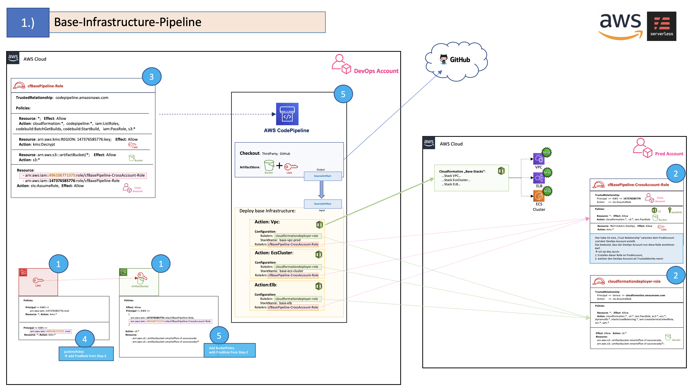
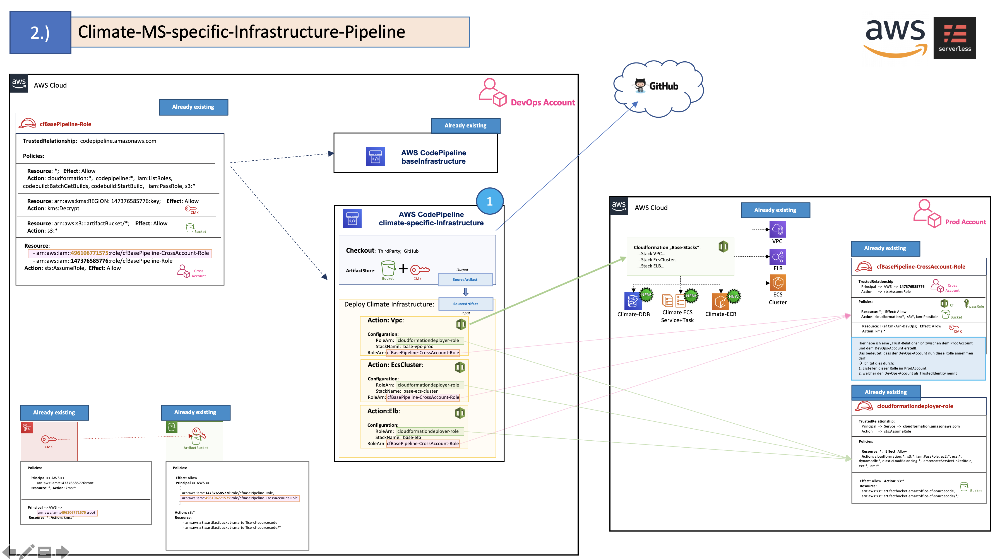
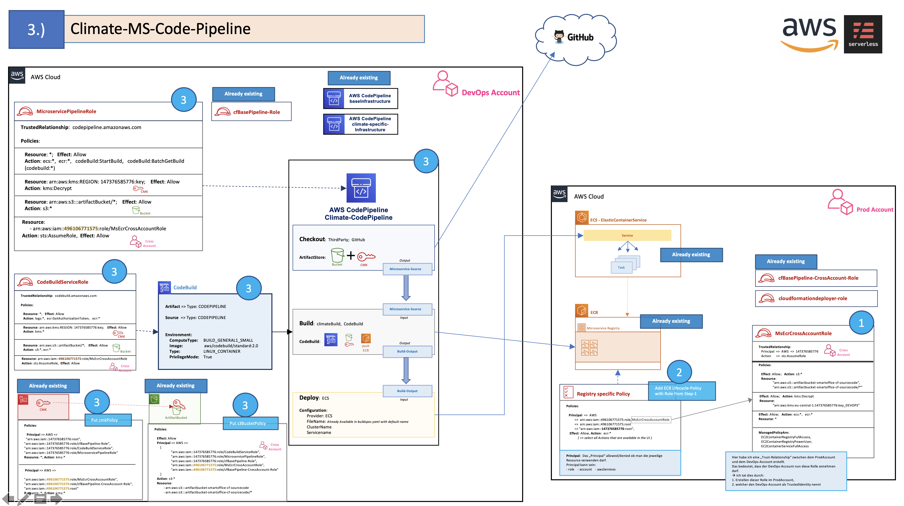

# aws-infrastructure
> Loibl_Michael

This Project includes the AWS-Infrastructure with MultiStage CI/CD Pipelines for 
* CloudFormation Deployments
* Code Deployment (Therefor, the `climate` Microservice in another gitHub Repo in the same organization is used)

## Case-01: Single CF+CodeDeployment Pipelines for every Microservice:

In Case-01 there is a Pipeline for the "base-cloudformation-stack". These are general Resources
like VPC, ECS-Cluster, ALB etc.

Then, in this Case-01, for every Microservice you have:
* One Pipeline for each Microservice specfic Cloudformation-Stacks
* One Pipeline for each Microservice-CodeDeployment to ECS itself

---

#### Advantages & Disadvantages of Case-01:
* Advantage:
    * Pipeline access policies are specific to each microservice. This enables very fine-grained access control for every Microservice Pipeline (Cf as well as CodeDeployment itself)
* Disadvantage:
    * With multiple microservices, the environment can be complicated and confusing because there are many pipelines + associated IAM Roles+policies
    for every Cf-Pipeline as well as the CodeDeployment Pipeline itself.

---

#### How to setup the Case-01

Use the [Makefile](./Makefile) that creates step-by-step the following Stacks with the associated Resources.
Enter `make help` to see how you can use the Makefile.

Single Steps of Case-01:

#### Step 1

#### Step 2

#### Step 3

---
---

## Case-02: One central CF+CodePipeline that can handle all Microservices:

todo...
